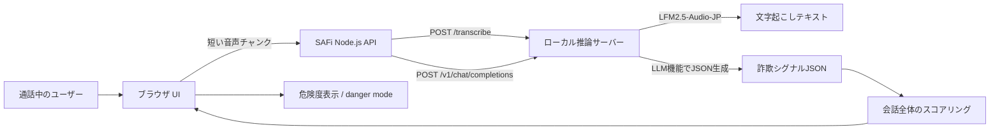
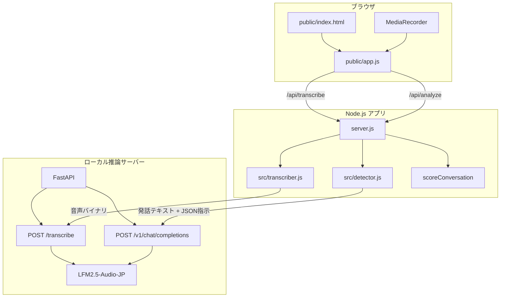

# SAFi

SAFi は、電話中の発話から特殊詐欺の兆候をリアルタイムに検知する Web アプリケーションです。

ブラウザで短い音声チャンクを録音し、音声文字起こしモデルでテキスト化します。その後、直近の発話を LLM に渡して、特殊詐欺でよく使われる表現や誘導を JSON として抽出し、危険度スコアを表示します。

## 想定ユースケース

- 高齢者や家族が、通話中に詐欺の兆候へ早めに気づく
- 金融機関、自治体、見守りサービスなどで、電話応対中のリスクを補助的に確認する
- 日本語の特殊詐欺表現に合わせた LFM2.5-Audio-JP の活用デモ

## アプリの流れ



## 構成



## 使用モデル

| 用途 | モデル |
| --- | --- |
| 音声文字起こし | `LiquidAI/LFM2.5-Audio-1.5B-JP` |
| 詐欺シグナル判定 | `LiquidAI/LFM2.5-Audio-1.5B-JP` |

このアプリは、ローカルにダウンロードした `LFM2.5-Audio-JP` をローカル推論サーバーで起動し、文字起こしと詐欺シグナル判定の両方に使う構成です。

## 主な機能

- ブラウザのマイク録音
- 数秒ごとの音声チャンク送信
- LFM2.5-Audio-JP による日本語文字起こし
- LFM2.5-Audio-JP の LLM 機能による特殊詐欺シグナル抽出
- 会話全体を使った危険度スコアリング
- 危険度が閾値を超えた場合の danger mode 表示
- 録音が使えない環境向けの手入力デモ
- ローカル推論API連携

## 検知するシグナル

LLM には、発話から以下の5つのシグナルを JSON で返すように要求します。

```json
{
  "is_authority": { "status": true, "text": "〇〇警察の生活安全課です" },
  "has_threat": { "status": true, "text": "あなたも疑われています" },
  "has_secrecy": { "status": true, "text": "捜査は秘密なので誰にも言わないで" },
  "ask_financial": { "status": true, "text": "今の残高はいくらですか" },
  "demand_action": { "status": true, "text": "今すぐATMにいけ" }
}
```

| キー | 意味 |
| --- | --- |
| `is_authority` | 警察、検察、銀行、自治体などの権威を名乗る |
| `has_threat` | 逮捕、凍結、犯罪などで不安をあおる |
| `has_secrecy` | 家族や他人に言わないよう指示する |
| `ask_financial` | 残高、口座、暗証番号、カード情報などを聞く |
| `demand_action` | ATM、送金、電子マネー購入などを急がせる |

## セットアップ

先に `LFM2.5-Audio-JP` をローカルに配置し、推論サーバーを起動します。

```txt
models/
  safi-lfm2.5-audio-jp/
```

`local_inference/real_server_template.py` を実装用ファイルにコピーし、モデル読み込みと推論処理を実装します。

```bash
pip install -r local_inference/requirements.txt
cp local_inference/real_server_template.py local_inference/server.py
uvicorn local_inference.server:app --host 127.0.0.1 --port 8088
```

別ターミナルで SAFi 本体を起動します。

```bash
npm install
npm start
```

起動後、ブラウザで開きます。

```txt
http://localhost:3000
```

マイク録音を使う場合は、`MediaRecorder` に対応したブラウザを使ってください。録音が使えない環境では、手入力欄から発話テキストを入力できます。

## ローカル推論API

SAFi は、ローカルに置いた `LFM2.5-Audio-JP` を推論サーバーとして起動し、HTTP API で呼び出します。

```txt
SAFi Node.js app
  ↓
Local inference server
  ├─ POST /transcribe
  └─ POST /v1/chat/completions
```

既定では次のローカルAPIを呼びます。

```txt
POST http://localhost:8088/transcribe
POST http://localhost:8088/v1/chat/completions
```

ポートやモデル名を変える場合だけ、以下の環境変数で上書きできます。

```bash
export TRANSCRIPTION_API_URL="http://localhost:8088/transcribe"
export DETECTOR_API_URL="http://localhost:8088/v1/chat/completions"
export TRANSCRIPTION_MODEL="./models/safi-lfm2.5-audio-jp"
export DETECTOR_MODEL="./models/safi-lfm2.5-audio-jp"
npm start
```

## ローカル推論APIの契約

### 音声文字起こし

SAFi は音声バイナリをそのまま送ります。

```http
POST /transcribe
Content-Type: audio/webm
X-SAFi-Model: ./models/safi-lfm2.5-audio-jp
```

レスポンス:

```json
{
  "text": "文字起こし結果"
}
```

### 詐欺シグナル判定

SAFi は OpenAI 互換の chat completions 形式でテキストを送ります。

```http
POST /v1/chat/completions
Content-Type: application/json
X-SAFi-Model: ./models/safi-lfm2.5-audio-jp
```

レスポンス例:

```json
{
  "choices": [
    {
      "message": {
        "content": "{\"is_authority\":{\"status\":true,\"text\":\"警察です\"},\"has_threat\":{\"status\":false,\"text\":\"\"},\"has_secrecy\":{\"status\":true,\"text\":\"誰にも言わないで\"},\"ask_financial\":{\"status\":false,\"text\":\"\"},\"demand_action\":{\"status\":true,\"text\":\"今すぐATMに行って\"}}"
      }
    }
  ]
}
```

`detector.js` 側では、OpenAI互換形式のほか、直接 `analysis` オブジェクトを返す形式にも対応しています。

## 実モデルに置き換える場所

最終的に fine-tuned model を読み込む処理は、以下を出発点にします。

```txt
local_inference/real_server_template.py
```

このテンプレートには、SAFi が必要とする HTTP ルートがすでに用意されています。実装時は、主に以下3つの関数の中身を書きます。

```txt
load_audio_model
run_audio_transcription
run_audio_llm_generation
```

詳しくは [local_inference/README.md](local_inference/README.md) を参照してください。

## ディレクトリ構成

```txt
.
├── public/
│   ├── index.html
│   ├── styles.css
│   ├── app.js
│   └── assets/
├── src/
│   ├── detector.js
│   ├── transcriber.js
│   └── models.js
├── local_inference/
│   ├── real_server_template.py
│   ├── requirements.txt
│   └── README.md
├── test/
├── server.js
└── package.json
```

## スクリプト

| コマンド | 説明 |
| --- | --- |
| `npm start` | SAFi本体を起動 |
| `npm run dev` | watch mode で開発起動 |
| `npm test` | Node.js のテストを実行 |

## 注意事項

- `models/` は `.gitignore` で除外しています。モデル本体はGitHubにコミットしないでください。
- `.env` もコミットしないでください。
- ローカル推論APIが起動していない場合、文字起こしと詐欺シグナル判定は失敗します。
- ハッカソン最終版では、ローカル推論サーバーに fine-tuned LFM2.5-Audio-JP を接続することで、LFM を使った構成として説明できます。
