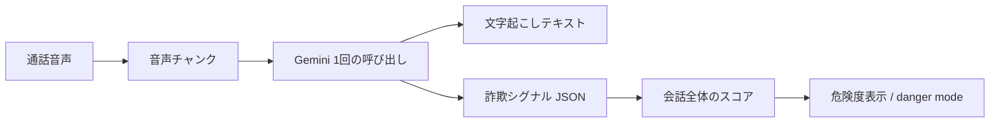
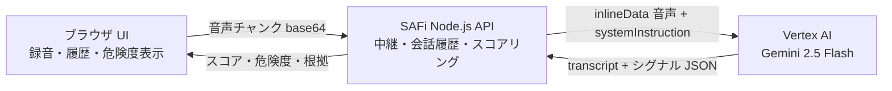

# SAFi

https://safi-300937800298.asia-northeast1.run.app

SAFi は、電話中の発話から特殊詐欺の兆候をリアルタイムに検知する Web アプリケーションです。

ブラウザで短い音声チャンクを録音し、Vertex AI 上の Gemini に送ります。Gemini は1回の呼び出しで「日本語の文字起こし」と「詐欺シグナルの判定」を同時に行い、構造化された JSON を返します。Node.js 側は会話全体のシグナルからスコアを計算し、危険度表示を更新します。

## 想定ユースケース

- 高齢者や家族が、通話中に詐欺の兆候へ早めに気づく
- 金融機関、自治体、見守りサービスなどで、電話応対中のリスクを補助的に確認する
- 日本語の特殊詐欺表現に特化したプロンプト設計のデモ

## アプリの流れ


```mermaid
flowchart LR
  call[通話音声] --> audio[音声チャンク]
  audio --> gemini[Gemini 1回の呼び出し]
  gemini --> transcript[文字起こしテキスト]
  gemini --> signals[詐欺シグナル JSON]
  signals --> score[会話全体のスコア]
  score --> risk[危険度表示 / danger mode]
```

文字起こしと判定を別々に呼ばず**1回のリクエストに統合**しているため、API コール数・レイテンシ・コストがいずれも半分で済みます。実測で1チャンクあたり約3秒です。

## 構成


```mermaid
flowchart LR
  browser[ブラウザ UI<br/>録音・履歴・危険度表示]
  node[SAFi Node.js API<br/>中継・会話履歴・スコアリング]
  vertex[Vertex AI<br/>Gemini 2.5 Flash]

  browser -->|音声チャンク base64| node
  node -->|inlineData 音声 + systemInstruction| vertex
  vertex -->|transcript + シグナル JSON| node
  node -->|スコア・危険度・根拠| browser
```

ブラウザは録音と表示、Node.js は Gemini への中継と会話全体のスコアリングを担当します。latch スコアリングに必要な過去の判定結果は**サーバー側のセッションストア**に保持します（クライアントに持たせるとスコアの根拠を改ざんできてしまうため）。

スコアはサーバーだけが計算します。Gemini は真偽値と根拠テキストしか返さず、点数を出力する余地がありません。これは、通話音声を発しているのが詐欺犯本人である以上、モデルへの入力全体が攻撃者の制御下にあるという前提に立った設計です。

## 使用モデル

| 用途 | モデル |
| --- | --- |
| 音声文字起こし + 詐欺シグナル判定 | `gemini-2.5-flash`（Vertex AI） |

`GEMINI_MODEL` で差し替え可能です。

## 主な機能

- ブラウザのマイク録音
- 数秒ごとの音声チャンク送信
- Gemini による日本語文字起こしと特殊詐欺シグナル抽出（1回の呼び出しで同時実行）
- 危険度が閾値を超えた場合の danger mode 表示
- 会話全体を使った latch 方式の危険度スコアリング
- 危険判定に入った瞬間のカナリア音アラート
- 無音・聞き取り不能なチャンクの自動スキップ
- プロンプトインジェクションでモデルの判定が抑え込まれた場合に備えたキーワードフロア

## 検知するシグナル

Gemini は `responseSchema` による structured output で、必ず次の形の JSON を返します。

```json
{
  "transcript": "もしもし、こちらは中央警察署生活安全課の田中と申します",
  "is_authority": { "status": true, "text": "中央警察署生活安全課の田中と申します" },
  "has_threat": { "status": false, "text": "" },
  "has_secrecy": { "status": false, "text": "" },
  "ask_financial": { "status": false, "text": "" },
  "demand_action": { "status": false, "text": "" }
}
```

| キー | 意味 | 配点 |
| --- | --- | --- |
| `is_authority` | 警察、検察、銀行、自治体などの権威を名乗る | 18 |
| `has_threat` | 逮捕、凍結、犯罪などで不安をあおる | 24 |
| `has_secrecy` | 家族や他人に言わないよう指示する | 22 |
| `ask_financial` | 残高、口座、暗証番号、カード情報などを聞く | 18 |
| `demand_action` | ATM、送金、電子マネー購入などを急がせる | 18 |

### スコアリング

一度検知したシグナルはフル加点で保持し続けます（latch）。詐欺は世間話から入って後から本題に移るため、直近の発話だけを見ると危険度が下がってしまうのを防ぐ狙いです。

さらに、単体では弱くても組み合わさると危険な手口に追加点を与えます。

| 条件 | 加点 |
| --- | --- |
| 2種類以上のシグナルが成立 | +5 |
| 3種類以上のシグナルが成立 | +10 |
| 口止め + 即時行動 | +8 |
| 脅し + 資産確認 | +7 |

合計スコア（上限100）から危険度を決定します。

| スコア | 危険度 |
| --- | --- |
| 75以上 | 危険（danger mode / カナリア音） |
| 50以上 | 警戒 |
| 25以上 | 注意 |
| 25未満 | 低リスク |

## セットアップ

### 必要なもの

- Node.js 20.12 以上（`process.loadEnvFile` を使用）
- Vertex AI API を有効にした Google Cloud プロジェクト
- `Vertex AI User` ロールを持つサービスアカウントの JSON 鍵
- `MediaRecorder` に対応したブラウザ（Chrome / Edge / Firefox）

### 手順

```bash
npm install
cp .env.example .env.local
# .env.local を編集して認証情報を設定
npm start
```

起動後、ブラウザで開きます。

```txt
http://localhost:3000
```

### 環境変数

`.env.local` に記述します。このファイルは `.gitignore` 済みです。

| 変数名 | 説明 | 必須 |
| --- | --- | --- |
| `GOOGLE_APPLICATION_CREDENTIALS` | サービスアカウント JSON のパス（絶対パス推奨） | ✅ |
| `GOOGLE_CLOUD_PROJECT` | Google Cloud プロジェクト ID | ✅ |
| `GOOGLE_CLOUD_LOCATION` | Vertex AI のリージョン（既定: `asia-northeast1`） | |
| `GEMINI_MODEL` | 使用するモデル（既定: `gemini-2.5-flash`） | |
| `PORT` | 待ち受けポート（既定: `3000`。Cloud Run では自動設定） | |
| `HOST` | 待ち受けアドレス（既定: ローカルは `127.0.0.1`、Cloud Run では `0.0.0.0`） | |
| `RATE_LIMIT_PER_IP` | IP単位のレート制限（既定: `20` req/分） | |
| `RATE_LIMIT_GLOBAL` | 全体のレート制限（既定: `60` req/分） | |
| `DAILY_REQUEST_LIMIT` | 1日あたりの総リクエスト上限（既定: `2000`） | |
| `HISTORY_RETENTION_DAYS` | 通話履歴の保持日数（既定: `90`） | |
| `HISTORY_API_KEY` | 設定すると `GET /api/history` に `X-SAFi-Api-Key` の一致を要求する | |

Cloud Run 上ではサービスアカウントの認証情報がメタデータサーバーから供給されるため、`GOOGLE_APPLICATION_CREDENTIALS` は不要です（`K_SERVICE` の有無で自動判定します）。

必須の変数が欠けている場合、起動時に不足している変数名をまとめて表示して停止します。

既定ではループバックのみで待ち受けます。`/api/analyze` には認証が無く、1リクエストごとに Vertex AI の課金が発生するため、同一ネットワークの他端末から叩かれないようにするためです。別端末から見せたい場合は `HOST=0.0.0.0` を明示してください（その場合はレート制限だけが歯止めになります）。

## デプロイ（Cloud Run）

```bash
gcloud run deploy safi \
  --source . \
  --project geosycle \
  --region asia-northeast1 \
  --allow-unauthenticated \
  --max-instances 1 \
  --min-instances 0 \
  --concurrency 10 \
  --cpu 1 --memory 512Mi --timeout 60 \
  --set-env-vars "GOOGLE_CLOUD_PROJECT=geosycle,GOOGLE_CLOUD_LOCATION=asia-northeast1,GEMINI_MODEL=gemini-2.5-flash,RATE_LIMIT_PER_IP=20,RATE_LIMIT_GLOBAL=60,DAILY_REQUEST_LIMIT=2000"
```

### `--max-instances 1` は必須です

会話履歴とレート制限をプロセスメモリに持っているため、複数インスタンスに分散すると次の2つが壊れます。

- 同じ通話のチャンクが別インスタンスに振り分けられ、latch スコアが積み上がらない
- レート制限がインスタンス数の倍だけ緩む

複数インスタンスで動かすには、履歴を外部ストア（Firestore / Redis 等）に移す必要があります。

### コストについて

費用の主役は Cloud Run ではなく Vertex AI の呼び出しです。Cloud Run 自体はデモ規模なら無料枠に収まり、`--min-instances 0` でアイドル時の課金も発生しません。

一方 `/api/analyze` には認証が無いため、URL を知っていれば誰でも Gemini を呼べます。歯止めは上記の3つのレート制限だけです。`DAILY_REQUEST_LIMIT=2000` は 4.5秒チャンク換算で通話約150分ぶんに相当します。公開範囲や利用状況に応じて調整してください。

より確実に総額を抑えるなら、GCP 側で予算アラート（できれば Pub/Sub 経由で課金を停止する Cloud Function）を併用してください。レート制限はスループットを抑えるだけで、総額そのものは保証しません。

## 通話履歴

遷移元のページから利用者情報を渡すと、通話ごとの記録が Firestore に残ります。

```txt
https://safi-300937800298.asia-northeast1.run.app/?userId=u_12345&displayName=山田太郎
```

読み取った利用者情報は `history.replaceState` で URL から消します。ブックマークや画面共有で利用者IDが意図せず出回るのを防ぐためです。値はメモリに保持して通話中ずっと使います。

### 何を残すか

履歴の目的は「あとから見て、**どの通話が実際に詐欺だったか**を特定できること」です。スコアだけでは通話の区別がつかず、かといって全文を蓄積すると電話をかけてきた相手を含む第三者の発言をそのまま溜め込むことになります。そこで**通話終了時に Gemini で要約を1回生成**し、要約と根拠の抜粋だけを保存します。

| フィールド | 内容 |
| --- | --- |
| `summary` | 通話全体の要約（2〜3文） |
| `callerClaim` | 相手が名乗った所属・立場 |
| `requestedAction` | 相手が求めてきた具体的な行動 |
| `signals` | 成立したシグナルと、その根拠となった発言の抜粋 |
| `score` / `riskLevel` | 最終スコアと危険度 |
| `startedAt` / `endedAt` / `utteranceCount` | 通話の時刻と発話数 |

**会話の全文は保存しません。**

### 保持期間

`HISTORY_RETENTION_DAYS`（既定90日）を過ぎた記録は、Firestore の TTL ポリシーが `expiresAt` を見て自動削除します。TTL は設定済みです。日数を変える場合、TTL ポリシー自体はフィールドを見るだけなので再設定は不要です。

### 必要な Firestore の設定

デプロイ済みプロジェクト（`geosycle`）では設定済みです。別プロジェクトで動かす場合は次の2つが要ります。

```bash
# 履歴を新しい順に引くための複合インデックス
gcloud firestore indexes composite create \
  --collection-group=callHistories \
  --field-config=field-path=userId,order=ascending \
  --field-config=field-path=endedAt,order=descending \
  --project=<PROJECT>

# 保持期間を過ぎた記録の自動削除
gcloud firestore fields ttls update expiresAt \
  --collection-group=callHistories --enable-ttl --project=<PROJECT>
```

### 履歴が残らないケース

- `userId` が渡っていない通話（匿名の通話記録は残しません）
- 発話が1件も無かった通話
- 停止も押さずタブも閉じずに放置された通話。`pagehide` で確定要求を投げていますが、それも届かなかった場合はセッションTTL（1時間）で破棄され、履歴には残りません

## 使い方

1. ブラウザで `http://localhost:3000` を開く
2. 「録音開始」を押してマイクの使用を許可する
3. 通話をそのまま続ける。約4.5秒ごとに音声が送信され、発話ログに文字起こしが追加される
4. 詐欺シグナルが検知されると、該当カードが点灯しスコアが上がる
5. スコアが75を超えると画面が danger mode に切り替わり、カナリア音が鳴る
6. 「停止」を押すと録音を終了し、サーバー側の会話履歴も破棄される

## API

### `POST /api/analyze`

音声チャンクを送り、文字起こし・判定・会話全体のスコアを受け取ります。

```json
{
  "sessionId": "7b1f...（通話ごとの UUID）",
  "audioBase64": "GkXfo59ChoEB...",
  "mimeType": "audio/webm;codecs=opus"
}
```

レスポンス:

```json
{
  "app": "SAFi",
  "utteranceCount": 3,
  "latest": {
    "text": "今すぐATMに行ってください",
    "analysis": { "demand_action": { "status": true, "text": "今すぐATMに行って" } }
  },
  "score": 100,
  "riskLevel": { "key": "danger", "label": "危険", "message": "..." },
  "signalScores": { "is_authority": 18, "has_threat": 24 },
  "evidence": { "is_authority": [{ "text": "...", "utterance": "..." }] },
  "recommendations": ["すぐに通話を終了する"]
}
```

無音や聞き取れないチャンクは `latest` が `null` になり、会話履歴には積まれません。

`sessionId` は UUID 形式のみ受け付けます。`mimeType` は音声系のみで、それ以外は 400 で拒否します（この API を汎用マルチモーダルプロキシとして悪用されないため）。

`userId` / `displayName` は任意です。渡すと通話終了時に履歴が残ります。渡さない場合、検知機能はそのまま動き、履歴だけが残りません。

### `POST /api/reset`

通話の終了です。利用者IDが分かっていれば、要約を生成して履歴を1件保存してからセッションを破棄します。

```json
{ "sessionId": "7b1f...", "userId": "u_12345" }
```

```json
{ "ok": true, "recorded": true, "historyId": "3jFdw0HXwQhhqEtXtTZV" }
```

### `GET /api/history?userId=xxx&limit=50`

利用者の通話履歴を新しい順に返します。`userId` は必須です（全件を返す口はありません）。

```json
{
  "userId": "u_12345",
  "count": 1,
  "calls": [
    {
      "id": "3jFdw0HXwQhhqEtXtTZV",
      "startedAt": "2026-07-25T10:41:46.736Z",
      "endedAt": "2026-07-25T10:42:03.428Z",
      "score": 100,
      "riskLevel": "danger",
      "utteranceCount": 5,
      "summary": "中央警察署生活安全課の田中と名乗る人物から電話があり、口座が特殊詐欺に利用された疑いがあるため逮捕される可能性があると告げられた。解決のためとして、預金残高と暗証番号を教えること、ATMで指定の口座に送金するよう求められた。",
      "callerClaim": "中央警察署生活安全課の田中",
      "requestedAction": "預金残高とキャッシュカードの暗証番号を教えること、およびATMで指定の口座に送金すること",
      "signals": [
        { "key": "is_authority", "label": "公的機関・権威の名乗り", "evidence": "中央警察署生活安全課の田中と申します" }
      ]
    }
  ]
}
```

### `GET /api/signals`

画面のカード見出しに使うシグナル定義を返します。定義元は `src/signals.js` の1箇所だけです。

```json
{ "signals": [{ "key": "is_authority", "label": "権威の名乗り", "weight": 18 }] }
```

### `GET /api/health`

```json
{ "ok": true, "app": "SAFi" }
```

## プロジェクト構成

```txt
.
├── public/
│   ├── index.html
│   ├── styles.css
│   ├── app.js            # 録音・API呼び出し・画面更新
│   └── assets/           # ロゴ、danger mode 画像、カナリア音
├── src/
│   ├── config.js         # 環境変数の検証（zod）
│   ├── signals.js        # 詐欺シグナルの定義（配点・ラベル・判定基準）
│   ├── prompt.js         # Gemini のシステム指示とレスポンススキーマ
│   ├── gemini.js         # Vertex AI クライアントと音声解析
│   ├── analysis.js       # モデル出力の正規化
│   ├── keywords.js       # 判定抑制に備えたキーワードフロア
│   ├── scoring.js        # latch スコアリングと危険度判定
│   ├── conversation.js   # 通話セッションごとの会話履歴ストア（インメモリ）
│   ├── summary.js        # 通話終了時の要約生成
│   ├── history.js        # 通話履歴の永続化（Firestore）
│   ├── requestSchemas.js # リクエストボディの検証（zod）
│   ├── staticFiles.js    # 静的配信のパス解決（トラバーサル防御）
│   └── ratelimit.js      # IP単位・全体のレート制限
├── test/
├── server.js
├── Dockerfile            # Cloud Run 用
├── .env.example
└── package.json
```

## スクリプト

| コマンド | 説明 |
| --- | --- |
| `npm start` | SAFi を起動 |
| `npm run dev` | watch mode で開発起動 |
| `npm test` | Node.js のテストを実行 |

## セキュリティ

### 認証情報

- サービスアカウント鍵はリポジトリに含めません。`.env.local` にパスだけを書き、`.gitignore` で除外しています
- 認証は Application Default Credentials 経由で、鍵の中身をコードが読むことはありません
- `.gitignore` は JSON を全部除外して `package.json` などだけを許可する方式にしています。GCP がダウンロードさせる鍵の既定ファイル名（`<project-id>-<12桁hex>.json`）を個別パターンで拾いきれないためです

### 入力とネットワーク

- 既定でループバック（`127.0.0.1`）のみに bind します
- `/api/analyze` と `/api/reset` に IP 単位・全体の2段のレート制限をかけています（1リクエストが Vertex AI の課金に直結するため）
- リクエストボディは zod で検証します。`sessionId` は UUID、`audioBase64` は base64 形式、`mimeType` は音声系のみの許可リスト
- ボディサイズ上限（12MB）は文字数ではなく実バイト数で判定します
- `Content-Type: application/json` を必須にし、`Origin` が異なるリクエストを拒否します（CORS プリフライトが失敗するため、悪意あるページからの呼び出しが通りません）
- 静的ファイル配信はパストラバーサル・壊れたパーセントエンコーディング・ヌルバイトを拒否します
- CSP、`nosniff`、`frame-ancestors 'none'`、`Permissions-Policy` を全レスポンスに付与しています

### データとモデル

- 通話中の会話履歴はプロセスメモリのみに保持し、TTL（1時間）とセッション数・発話数の上限で自動的に破棄されます
- Firestore に残すのは要約と根拠の抜粋だけで、会話の全文は保存しません。保持期間を過ぎた記録は TTL ポリシーが自動削除します
- 利用者情報はクエリパラメータで受け取り、読み取り後すぐ URL から除去します
- スコアはサーバーだけが計算します。モデルは真偽値と根拠テキストしか返さないため、出力に点数を混ぜ込むことはできません
- 音声を発しているのが詐欺犯本人である以上、モデルへの入力は攻撃者の制御下にあります。判定を抑え込む発言への対策として、システム指示での明示的な拒否と、文字起こしに対する決定的なキーワードフロアの2段構えにしています
- エラーレスポンスに内部情報を含めません（詳細はサーバーログにのみ出力）

### 既知の限界

このアプリはハッカソン向けのデモです。本番運用するには最低限、以下が必要です。

- **`userId` は本人確認になっていません。** クエリパラメータで平文で受け取っているため、他人のIDを名乗って履歴を汚したり、`GET /api/history?userId=...` で他人の要約を読んだりできます。実運用では遷移元に署名付きトークン（JWT等）を発行してもらい、SAFi 側で検証する必要があります。当面の緩和策として `HISTORY_API_KEY` を設定すると、履歴の読み出しにキーを要求できます
- `/api/analyze` の認証（現状、Cloud Run の URL を知っていれば誰でも呼べます）
- GCP 側の予算上限とアラート（レート制限はスループットを抑えるだけで、総額は抑えません）
- セッションIDをリクエストボディではなく `httpOnly` Cookie から導出する方式への変更
- 会話履歴の外部ストア化（現状はインメモリのため `--max-instances 1` から増やせません）

## ライセンス

MIT
