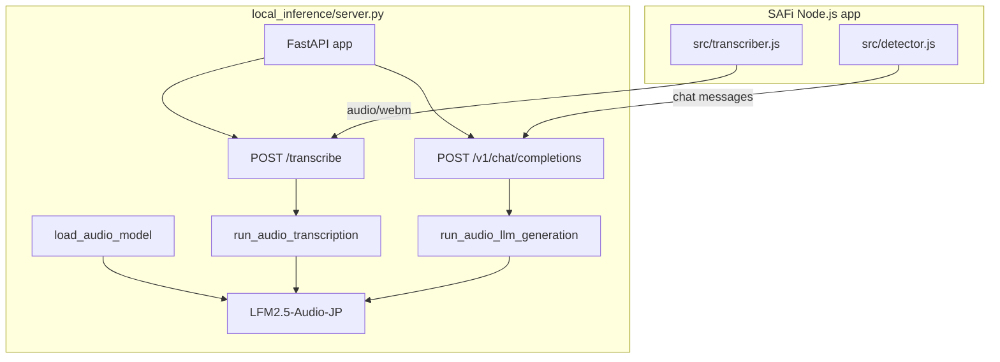
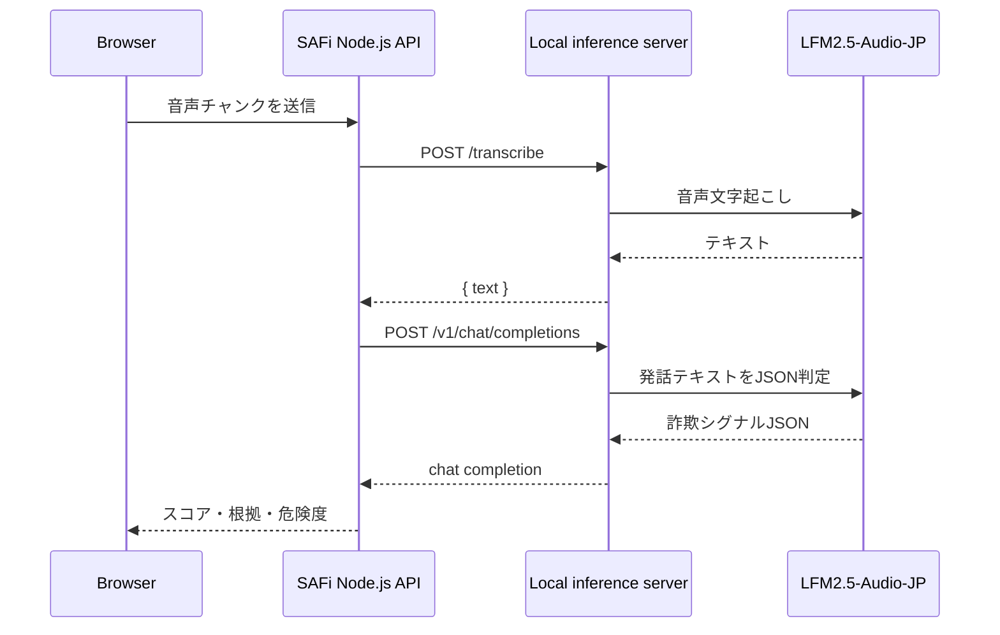

# SAFi ローカル推論レイヤー

このフォルダは、最終的に **ファインチューニング済みの LFM2.5-Audio-JP モデルをローカルで動かすための置き換え場所** です。

今の SAFi 本体は Node.js で動いていますが、モデル本体は Node.js に直接読み込ませません。  
代わりに、このフォルダでローカル推論サーバーを立て、SAFi から HTTP API として呼び出します。

## 構成



## SAFi が期待するAPI

SAFi はローカル推論サーバーに対して、次の2つのエンドポイントを呼びます。



```txt
POST /transcribe
```

音声バイナリを受け取り、文字起こし結果を返します。

```json
{ "text": "文字起こし結果" }
```

```txt
POST /v1/chat/completions
```

文字起こしされた発話テキストを受け取り、特殊詐欺シグナルのJSONを返します。  
OpenAI互換の `chat/completions` 形式にしてあるので、SAFi側の実装をほとんど変えずに接続できます。

## 現在のファイル

- `real_server_template.py`
  - 最終的に本物のローカル推論サーバーへ置き換えるためのテンプレートです。
  - まだそのままでは動きません。
  - モデル形式や実行ランタイムが決まったあと、指定された関数の中身を書きます。

- `requirements.txt`
  - Pythonでローカル推論サーバーを書く場合の最小依存です。

## 最終的な置き換え手順

1. ダウンロード済み、またはファインチューニング済みのモデルを配置します。

例:

```txt
models/
  safi-lfm2.5-audio-jp/
```

`models/` は重いので GitHub には入れません。`.gitignore` で除外しています。

2. テンプレートを実装用ファイルにコピーします。

```bash
cp local_inference/real_server_template.py local_inference/server.py
```

3. `server.py` の中で、次の3つの関数を実装します。

```txt
load_audio_model
run_audio_transcription
run_audio_llm_generation
```

それぞれの役割は以下です。

```txt
load_audio_model
  LFM2.5-Audio のモデルファイルを読み込む

run_audio_transcription
  音声ファイルを LFM2.5-Audio に渡して文字起こしする

run_audio_llm_generation
  発話テキストを LFM2.5-Audio-JP の LLM 機能に渡し、詐欺シグナルJSONを生成する
```

4. ローカル推論サーバーを起動します。

例:

```bash
uvicorn local_inference.server:app --host 127.0.0.1 --port 8088
```

5. SAFi 本体をローカル推論APIへ向けます。

```bash
export TRANSCRIPTION_API_URL="http://localhost:8088/transcribe"
export DETECTOR_API_URL="http://localhost:8088/v1/chat/completions"
export TRANSCRIPTION_MODEL="./models/safi-lfm2.5-audio-jp"
export DETECTOR_MODEL="./models/safi-lfm2.5-audio-jp"
npm start
```
